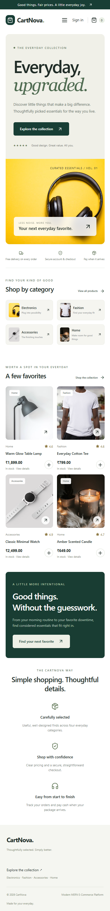

# CartNova

**Modern MERN E-Commerce Platform** — a beginner-friendly, full-stack store built with React, Express, MongoDB and Node.js. Thoughtfully selected essentials, a responsive storefront, and an approachable admin workspace.

**Vercel URL:** https://cartnova-gilt.vercel.app — deployed; production MongoDB setup is still pending. Catalog, accounts and checkout require the database connection before they can work.

**GitHub Repository:** https://github.com/aadarshkumar-rai5/cartnova

[Deploy with Render](https://render.com/deploy?repo=https://github.com/aadarshkumar-rai5/cartnova)

## Features

- Register, log in, log out, and view a profile; bcrypt passwords and JWT authentication in an HttpOnly cookie.
- Search products, filter by category and maximum price, and sort by price.
- Product details with stock availability, ratings, and quantity selection.
- Persistent shopping cart with quantity limits and integer-cent totals.
- Protected checkout with shipping details and cash on delivery only.
- Personal order history and order ownership checks.
- Admin dashboard, product CRUD, customer orders, and order status updates.
- Transactional stock deductions, concurrent checkout protection, cancellation restocking, and server-calculated prices.
- Responsive UI, accessible form labels, loading indicators, friendly errors, and empty states.
- Non-destructive sample seeder with 12 products and a separate admin creation script.

This is a portfolio application, not a real retailer. Sample listings and ratings are illustrative. Product images are public Unsplash URLs and require internet access. No payment gateway is connected.

## Tech stack

React + Vite, JavaScript, Tailwind CSS, React Router, Axios, Context API, Lucide icons; Node.js, Express, MongoDB, Mongoose, JWT, bcryptjs, dotenv, cors, cookie-parser, Helmet and express-rate-limit.

## Screenshots

Desktop homepage:


Mobile homepage:



## Installation

Requirements: Node.js 22.12+ (or Node.js 24), npm, and MongoDB Atlas or a local **replica set**. Transactions require a replica set; a standalone MongoDB server cannot place orders. Atlas provides replica sets automatically.

1. Clone this repository and open its folder.
2. Run `npm run install:all` from the root, or run `npm install` separately in `backend` and `frontend`.
3. Copy `backend/.env.example` to `backend/.env`.
4. Set `MONGO_URI` and a random `JWT_SECRET` of at least 32 characters. Generate one with `node -e "console.log(require('crypto').randomBytes(48).toString('hex'))"`.
5. In `backend`, run `npm run seed`.
6. Start the backend and frontend in separate terminals.

Backend:

```sh
cd backend
npm install
npm run dev
```

Frontend:

```sh
cd frontend
npm install
npm run dev
```

Visit http://localhost:5173. The backend runs at http://localhost:5000. Vite proxies `/api` to the backend, keeping requests same-origin in the browser. Use the displayed localhost URL consistently for cookie authentication.

## Environment variables

All application secrets live in `backend/.env` locally or the hosting provider's environment settings. Never put secrets in frontend variables or commit `.env`.

| Variable                                      | Purpose                                                                                                          |
| --------------------------------------------- | ---------------------------------------------------------------------------------------------------------------- |
| `MONGO_URI`                                   | MongoDB replica-set connection string                                                                            |
| `JWT_SECRET`                                  | Random secret, minimum 32 characters                                                                             |
| `PORT`                                        | Backend port; defaults to 5000                                                                                   |
| `CLIENT_URL`                                  | Exact browser origin, without trailing slash; localhost:5173 in development, deployed HTTPS origin in production |
| `NODE_ENV`                                    | `development` locally, `production` on hosting                                                                   |
| `ADMIN_NAME`, `ADMIN_EMAIL`, `ADMIN_PASSWORD` | Used only by the admin creation script                                                                           |

No frontend environment variables are required. The production Express server serves the built React app and `/api` on the same origin. Cookies use HttpOnly and SameSite=Lax; production cookies also use Secure.

## Create your admin

There is deliberately no published default admin password.

1. Set `ADMIN_NAME`, `ADMIN_EMAIL`, and `ADMIN_PASSWORD` in `backend/.env`.
2. Choose a password of at least 8 characters and at most 72 UTF-8 bytes.
3. Run `npm run admin` from `backend`.
4. Sign in with those credentials and open `/admin`.
5. Remove the `ADMIN_*` values from your local file or hosting environment after creation.

The script refuses to modify an existing account. Public registration always creates a regular user, even if an admin role is submitted manually.

## Test user

Open `/register` and create a regular account using a test email and your own password. Add a product, open your bag, proceed to checkout, and provide fictitious shipping details. Place the cash-on-delivery order and inspect `/orders`. Sign in separately as admin to ship and deliver it.

## Tests and production build

```sh
npm test
npm run build
```

The API integration suite starts a disposable MongoDB replica set and does not touch your configured database. The first run downloads a MongoDB test binary. Tests cover role escalation, cookie security, invalid login, duplicate accounts, product validation, ownership, forged checkout totals, transaction rollback, status transitions, cancellation, concurrent checkout and logout.

For browser verification, build first, then run `node backend/tests/preview.js` in one terminal. In another, run `npx playwright test` from `frontend`. The configuration uses Microsoft Edge; install Edge or change `channel` to an installed browser. The preview uses temporary data, localhost only, and a random session secret. It is not production hosting. Stop it with Ctrl+C.

## Deployment

### Vercel

Import [this repository into Vercel](https://vercel.com/new/clone?repository-url=https%3A%2F%2Fgithub.com%2Faadarshkumar-rai5%2Fcartnova), keeping the project root at the repository root (not `frontend`). The included `vercel.json` builds Vite, serves static assets, routes `/api/*` to the Express function, and supports React Router page refreshes.

Before deploying, set these **Production** environment variables in Vercel:

- `MONGO_URI`: your persistent MongoDB Atlas connection string, including the database name.
- `JWT_SECRET`: a random secret of at least 32 characters.
- `CLIENT_URL`: the exact production HTTPS origin, such as `https://your-project.vercel.app`, without a trailing slash.
- `NODE_ENV`: `production`.

Use Node.js 22 or 24. If the production domain changes, update `CLIENT_URL` and redeploy. The origin restriction intentionally does not authorize arbitrary Vercel preview domains. Configure preview-specific values if testing a preview deployment.

Allow Atlas network access from the deployment, then run the existing seed and admin scripts against that database from a trusted local environment. Neither credentials nor a database are bundled into the deployment. The local disposable MongoDB preview cannot be used as a production database.

Verify `/api/health`, registration, checkout and order history after deployment. The function reuses MongoDB connections across warm requests and returns a friendly 503 if its database or signing secret is unavailable. See [Vercel's Node.js function documentation](https://vercel.com/docs/functions/runtimes/node-js).

### Render (alternative)

The included `render.yaml` deploys one Node web service that serves both the Express API and the built Vite app. This simplifies cookies and avoids cross-domain authentication.

1. Push the repository to your GitHub account.
2. In Render, create a Blueprint from the repository, or a Node web service.
3. Build command: `npm ci --prefix backend && npm ci --prefix frontend && npm run build`.
4. Start command: `npm start`. Health check: `/api/health`.
5. Set `NODE_ENV=production`, `MONGO_URI`, a random `JWT_SECRET`, and `CLIENT_URL` to the final HTTPS site origin (no trailing slash). The Blueprint generates the JWT secret.
6. Allow the hosting service to reach your Atlas database using Atlas network access settings and a database user restricted to this database.
7. Seed production once using `npm run seed` in `backend`, and create your admin using `npm run admin`. Run these from a host shell or locally with the production database configuration. Do not run them on every server start.
8. Open the deployed homepage, register, place a test order, and verify admin access and `/api/health`.

See [Render's Express deployment guide](https://render.com/docs/deploy-node-express-app). Hosting availability and pricing are controlled by the provider. Production deployment is not complete until the database, environment variables, and live health checks are configured and verified.

## API endpoints

| Method      | Endpoint                 | Access                                                                     |
| ----------- | ------------------------ | -------------------------------------------------------------------------- |
| POST        | `/api/auth/register`     | Public                                                                     |
| POST        | `/api/auth/login`        | Public                                                                     |
| POST        | `/api/auth/logout`       | Public                                                                     |
| GET         | `/api/auth/profile`      | Signed in                                                                  |
| GET         | `/api/products`          | Public; `search`, `category`, `maxPrice`, `sort=price-asc` or `price-desc` |
| GET         | `/api/products/:id`      | Public                                                                     |
| POST        | `/api/products`          | Admin                                                                      |
| PUT, DELETE | `/api/products/:id`      | Admin                                                                      |
| POST        | `/api/orders`            | Signed in                                                                  |
| GET         | `/api/orders/my`         | Signed in; own orders                                                      |
| GET         | `/api/orders`            | Admin                                                                      |
| GET         | `/api/orders/:id`        | Owner or admin                                                             |
| PUT         | `/api/orders/:id/status` | Admin                                                                      |
| GET         | `/api/users`             | Admin                                                                      |
| GET         | `/api/users/stats`       | Admin                                                                      |
| GET         | `/api/health`            | Public                                                                     |

Mutation requests must send `Content-Type: application/json`, including logout and DELETE (`{}` is enough). Browser requests from an unexpected Origin are rejected. Orders accept only product IDs, integer quantities, and shipping fields; prices and roles are never trusted from the client.

## Folder structure

```text
backend/
  config/db.js
  controllers/       # Authentication, products, orders, users
  middleware/        # Authentication, admin authorization, errors
  models/            # User, Product, Order Mongoose schemas
  routes/            # REST routes and middleware chains
  utils/validation.js
  tests/             # API tests and disposable preview
  app.js             # Express middleware and routes
  server.js          # Environment checks, database, HTTP listener
  sampleProducts.js
  seed.js
  createAdmin.js
  .env.example
frontend/
  src/
    components/      # Shared UI and route guards
    pages/           # Customer pages
    admin/           # Dashboard, product CRUD, order management
    context/         # Authentication and cart state
    services/api.js  # Axios client and currency formatting
    App.jsx
    main.jsx
    styles.css
  tests/             # Browser journeys
docs/                # Screenshots and interview guide
render.yaml
.github/workflows/ci.yml
```

## Application flow

**React → Axios → Express route → controller → Mongoose → MongoDB → JSON response → React UI.**

Registration hashes a password, stores the user, and sends a signed JWT in an HttpOnly cookie. Axios includes that cookie with API calls. Authentication middleware verifies it and loads the current user; admin middleware checks the database role. React route guards improve navigation, while backend middleware enforces the actual permissions.

The cart lives in Context and persists non-sensitive product snapshots in localStorage. Checkout sends IDs and quantities. The server validates shipping fields, rereads product prices, atomically reserves stock, and creates an order in a MongoDB transaction. On success React clears the cart and loads the saved order history. On failure the transaction rolls back. Admins can move Processing → Shipped → Delivered, or Processing → Cancelled. Cancellation restores inventory exactly once. Revenue counts delivered orders only.

## Before your interview

Study the focused [interview guide](docs/INTERVIEW.md), including 15 project-specific questions and suggested talking points.

## Future improvements and limits

- Pagination and database indexes for large catalogs and order history.
- Email verification, password reset, and session revocation for stronger account lifecycle management. Current logout clears the browser cookie; an already stolen JWT remains valid until expiration.
- Checkout idempotency keys to handle retries after network failures without duplicate orders.
- Product variants, image uploads, customer reviews, and configurable shipping/tax rules.
- Reconcile cart snapshots against current catalog data before checkout; the server already validates final stock and prices.
- A distributed rate-limit store for multi-instance deployments.
- Refund and return workflows if a real payment provider is added later.

Keep those tradeoffs explicit in interviews: this application focuses on a complete and understandable core MERN flow.
